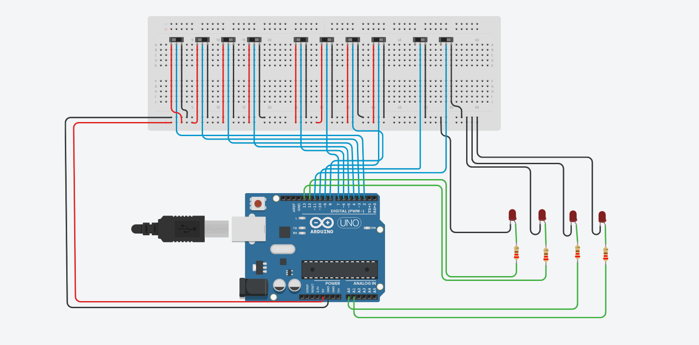
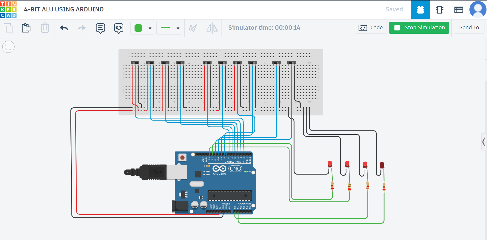

# Arduino-Based-4bit-ALU

## Overview
This project implements a 4-bit Arithmetic Logic Unit (ALU) using Arduino Uno and Tinkercad simulation.

The ALU performs arithmetic and logical operations on two 4-bit binary inputs and displays the result using LEDs.

---

## Features
- 4-bit Addition
- 4-bit Subtraction
- Bitwise AND
- Bitwise OR

---

## Components Used
- Arduino Uno
- Breadboard
- Slide Switches
- LEDs
- Resistors
- Jumper Wires

---

## Operation Table

| OP1 | OP0 | Operation |
|------|------|------------|
| 0 | 0 | Addition |
| 0 | 1 | Subtraction |
| 1 | 0 | AND |
| 1 | 1 | OR |

---

## Software Used
- Arduino IDE
- Tinkercad

---

## Circuit Diagram

---

## ALU Schematic

---

## Working Output

---

## Working Principle
Two 4-bit binary inputs A and B are provided using slide switches.

The operation is selected using OP1 and OP0 control switches.

The Arduino processes the selected arithmetic or logical operation and displays the output through LEDs.

---

## Tinkercad Simulation
[Open Simulation Here](https://www.tinkercad.com/things/3xe1DQyERSB-4-bit-alu-using-arduino?sharecode=4z8xpmiHENpdRpmdBSKtpgM--7FsqrwR0XtLGr_Ioks)

---

## Future Improvements
- Carry flag implementation
- Overflow detection
- FPGA implementation
- IC-based ALU design

---

## Author
Aneesa
